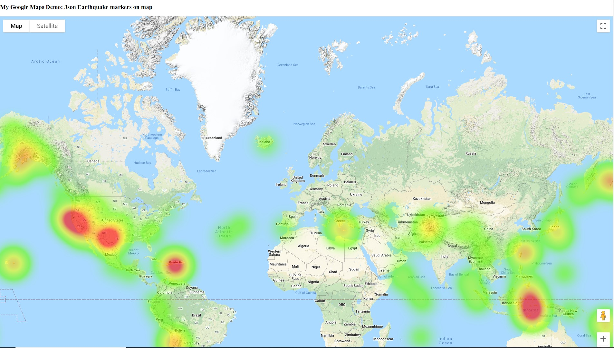

# Sample screenshot
Heatmap from [usgs.gov earthquake data](https://www.usgs.gov/programs/earthquake-hazards/earthquakes), where earthquake magnitude is represented as weights on Google Maps (in [GeoJSON format](https://earthquake.usgs.gov/earthquakes/feed/v1.0/geojson.php)). 
The data shows all M2.5+ earthquakes in the last 7 days worldwide. 

