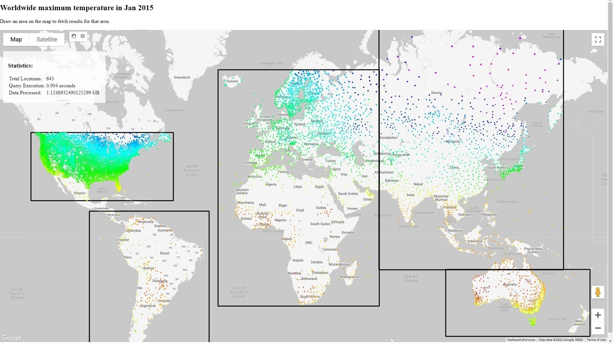
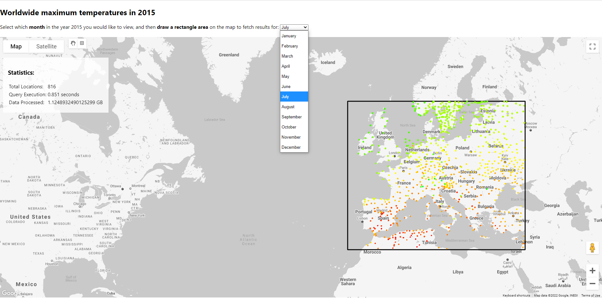

# GoogleMapsPlatform-demo
Some small tests on the Google Maps Platform:

1. **[Fixed marker on map](1_MarkerOnMap)** 
Small Hello World by adding a *hardcoded* marker to a Google Maps, embedded in a webpage. 

2. **[Markers from external GeoJSON data](2_MarkersFromJsonOnMap)** 
Map out [usgs.gov earthquake data](https://www.usgs.gov/programs/earthquake-hazards/earthquakes) as markers on Google Maps (in [GeoJSON format](https://earthquake.usgs.gov/earthquakes/feed/v1.0/geojson.php)). 
The data shows all M2.5+ earthquakes in the last 7 days worldwide. 

3. **[Weighted heatmap from external GeoJSON data](3_HeatmapFromJsonOnMap)** 
Heatmap from [usgs.gov earthquake data](https://www.usgs.gov/programs/earthquake-hazards/earthquakes), where earthquake magnitude is represented as weights on Google Maps (in [GeoJSON format](https://earthquake.usgs.gov/earthquakes/feed/v1.0/geojson.php)). 
The data shows all M2.5+ earthquakes in the last 7 days worldwide. 

4. **[Mapping color-coded historic temperatures from BigQuery](4_TemperatureHeatmapFromBigQueryOnMap)** 
Display [historic temperatures from NOAA public data](https://console.cloud.google.com/marketplace/product/noaa-public/ghcn-d?project=focal-elf-336022) for a specific month *(hardcoded)* on a map. Make use of the rectangle drawing component to highlight an area in the world for which you would like to display data. The data is then retrieved from BigQuery and displayed on the map, color-coded from blue (cold) to red (hot) related to the temperature data. The map has been custom styled.  

5. **[Customizing map-results based on external input](5_TemperatureHeatmapFromBigQueryOnMapWithExternalInput)** 
Similar to the previous sample, mapping data from BigQuery on the Google Maps Platform, although now we take external input from a dropdown to customize the results. Users can now choose the timeframe being displayed. 
Side-note: for now we re-render the entire map and ask the user to make a new selection after updating the month, as we don't keep a reference to the last recentangle drawn by the user.  
